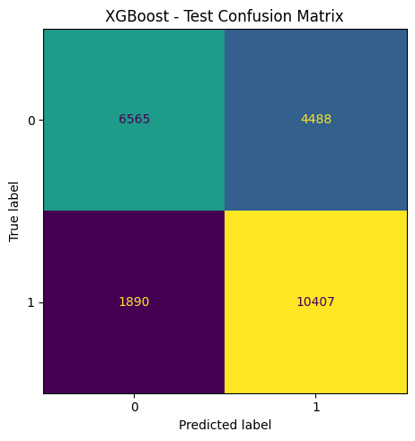
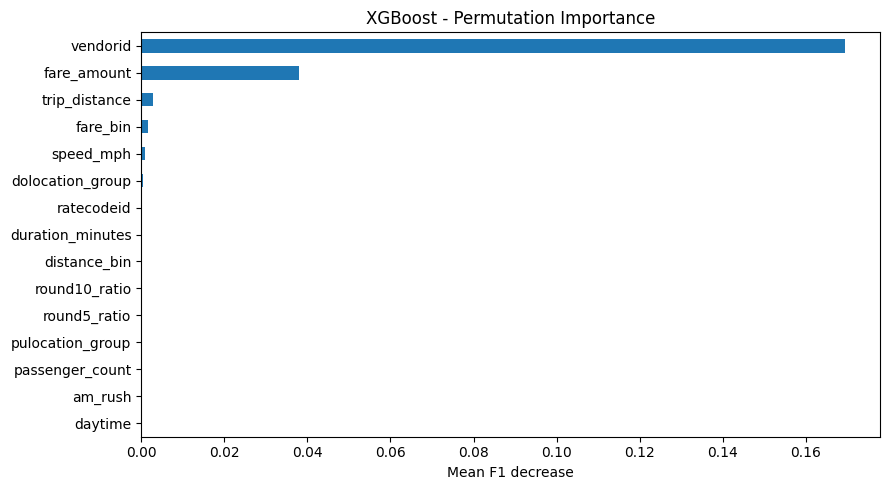
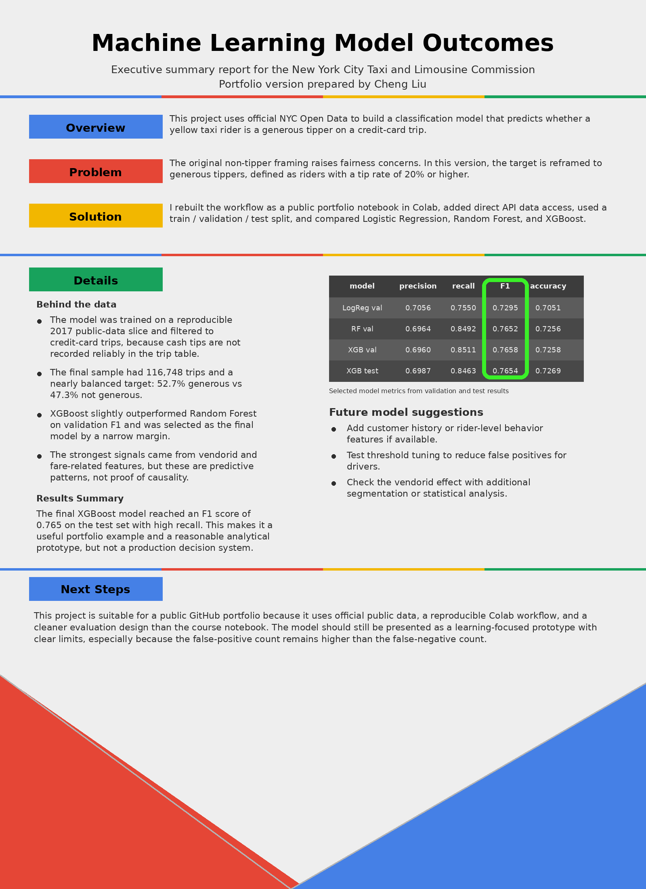

# Project Walkthrough

## 1. Project overview

This is my public portfolio rewrite of the Automatidata project from the Google Advanced Data Analytics program.

I used official NYC Open Data and rebuilt the full workflow in Colab. The project predicts whether a credit-card yellow taxi trip ended with a tip rate of 20 percent or higher.

Useful files:

- [Notebook version](../notebooks/01-automatidata-portfolio-project.ipynb)
- [Exported Python script view](../scripts/01-automatidata-portfolio-project.py)
- [Portfolio PDF report](../reports/automatidata-portfolio-report-cheng-liu.pdf)
- [Data note](../data/README.md)
- [Contribution note](../contribution-note.md)

---

## 2. Business problem

The original classroom scenario focused on non-tippers. I did not want to keep that framing in a public portfolio project because it can create fairness concerns.

So I changed the target to **generous tipping**:

- `1` = tip rate >= 20%
- `0` = tip rate < 20%

This still keeps the project useful for tip-behavior analysis, but it is a more responsible setup.

---

## 3. Dataset

I used the official **2017 Yellow Taxi Trip Data** from NYC Open Data.

In this version, I did not rely on local course CSV files. The notebook and exported script pull data directly from the official API.

Main data setup:

- public-data sample pulled: **180,000 rows**
- filtered modeling sample: **116,748 credit-card trips**
- original API fields pulled first: **13**
- final modeling inputs before one-hot encoding: **21**

More source details are in [data/README.md](../data/README.md).

---

## 4. Workflow

My workflow was:

1. pull the data by API
2. clean the records
3. keep only credit-card trips
4. create the target
5. engineer time, fare, trip, and location features
6. split data into train / validation / test
7. compare three classifiers
8. choose the final model by validation F1
9. evaluate once on the test set
10. explain the result with charts and a short report

---

## 5. Selected code

### Official data pull

```python
API_ENDPOINT = "https://data.cityofnewyork.us/resource/biws-g3hs.csv"

selected_columns = [
    "vendorid",
    "tpep_pickup_datetime",
    "tpep_dropoff_datetime",
    "passenger_count",
    "trip_distance",
    "ratecodeid",
    "pulocationid",
    "dolocationid",
    "payment_type",
    "fare_amount",
    "tip_amount",
    "tolls_amount",
    "total_amount"
]
```

This was the main change that made the project easier to rerun in public.

### Target and feature engineering

```python
df["tip_percent"] = np.round(
    df["tip_amount"] / (df["total_amount"] - df["tip_amount"]), 3
)
df["generous"] = (df["tip_percent"] >= 0.20).astype(int)

df["speed_mph"] = df["trip_distance"] / (df["duration_minutes"] / 60)
df["round5_ratio"] = (
    (np.ceil(df["fare_amount"] / 5) * 5) - df["fare_amount"]
) / df["fare_amount"]
```

I kept the main idea from the course, but I added more portfolio-friendly features such as speed, fare bins, and round-up ratios.

### Models compared

- Logistic Regression
- Random Forest
- XGBoost

I used a **train / validation / test** split so final model selection would not depend only on the test set.

---

## 6. Key visuals

### XGBoost test confusion matrix



This chart shows that the model captured many actual generous trips, but false positives are still meaningful and should be explained clearly.

### XGBoost permutation importance



This chart shows that `vendorid` and fare-related features were much stronger than the other variables in this version.

### One-page executive summary



I also prepared a one-page summary so someone can understand the project very quickly before opening the notebook or PDF.

---

## 7. Results

Final model: **XGBoost**

Main results:

- Validation F1: **76.58%**
- Test F1: **76.54%**
- Precision: **69.87%**
- Recall: **84.63%**
- Accuracy: **72.69%**

My read is:

- XGBoost and Random Forest were almost tied
- XGBoost won by a narrow validation margin
- the test result stayed close to validation
- the setup looks stable enough for a portfolio project

---

## 8. Main insights

What stood out most:

- public trip-level data does contain usable signal for generous tipping
- `vendorid` seems to act like a very strong proxy variable
- fare-related variables matter more than many time flags in this version
- the model is useful as a learning and insight project, but not as a strict decision tool

---

## 9. Limits

I kept these limits very clear:

- this repo uses a public-data slice, not the full 2017 table
- the model only represents **credit-card trips**
- strong feature importance does not mean direct causality
- the project should be presented as a **prototype**, not a production system

---

## 10. Conclusion

This project is one of my cleaner public portfolio examples.

It shows that I can take a classroom scenario, rebuild it with official public data, compare multiple models, and explain both the result and the limits in simple English.

For my job search, I think this project is useful because it shows:

- practical Python and Colab workflow
- public-data access from an official source
- feature engineering and model comparison
- honest model interpretation
- clear portfolio communication
